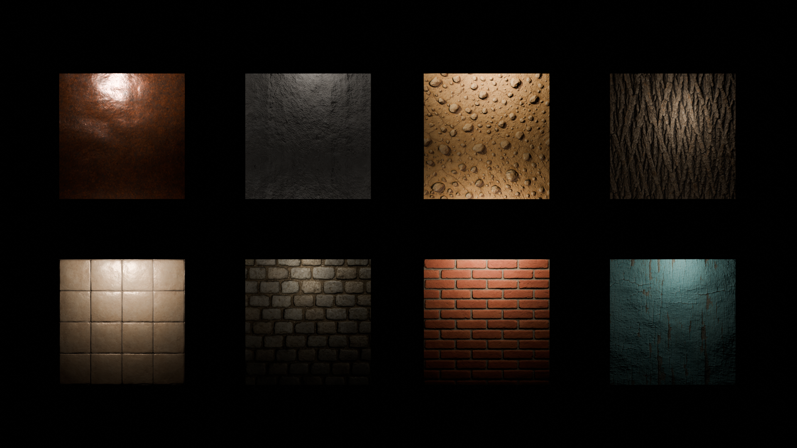

# Open Mats
An addon that integrates OpenAI prompt-based image generation directly into Blender, with support for HugoTini's DeepBump for local normal map and depth map processing.



# Installation
1. Download the addon from the [main](https://github.com/maxgoldblatt/OpenMats) branch of the Openmats Github repository.
2. Open Blender
3. Navigate to:
```bash
Edit > Preferences > Add - Ons > Install from Disk
```
4. Select the .zip file downloaded from the [main](https://github.com/maxgoldblatt/OpenMats) branch of the Openmats Github repository.
5. Navigate to the OpenAI [Platform](https://platform.openai.com/) Page
6. Create a verified organization, and create an API Key.
7. Once API Key is retrieved, create a .txt file containing ONLY your API-Key. It should have no formatting. Name it "Key.txt" or something similiar.
8. Head Back to Blender, under the OpenMats addon preferences, there is a section labeled "Enter your OpenAI API Key". paste the directory to the newly created "Key.txt" in this field. This allows the program to access your API key without any truncation.

# Usage
1. In Blender, open the **OpenMats** panel:
   - Naviage to the **3D Viewport > Sidebar (N Panel) > OpenMats** tab.
   - Save the Blender File in a directory that Blender has permissions to edit.

2. **Enter a prompt** in the text field:
   - Example: `Peeling painted wood with weathering and cracks seamless diffuse texture`
   - Choose between DALL·E 2, DALL·E 3, or GPT-Images.

3. Select optional material presets:
   - Toggle options for **Metal**, **Diffuse**, or **Specular** material presets before generating.
   - These presets modify BSDF shader properties automatically.
4. Toggle System Console:
   - In Blender, navigate to **Window > Toggle System Console**
   - This will allow the user to monitor generation progress, as Blender will be unresponsive whilist generation is occuring.

5. Click **"Generate Image"**:
   - The image prompt is sent to OpenAI's generation models via the OpenAI API.
   - It will be downloaded to your system and added as a texture node in a new material.\
   - The program creates a new "Textures" folder in the same directory as the .blend file
   - The user may create as many new generations as they would like before moving onto the next step.

6. **Normal and Depth Map Generation**:
   - Once an image is generated, click **"Generate Normal Map (CPU)"** to use **DeepBump** (ONNX-based) inference for creating a normal map.
   - Once a normal map is created, click the **Generate Height Map (CPU)** to use **DeepBump** (ONX-based) inference for creating a depth map.
   - Be sure to check the **Seamless Normal Map?** option within the addon if your texture is tilable or seamless.
     
7. **Texture Adjustments**:
   - Within the created material, adjust the Value Node entitled **Scale** to change the size of the texture.
   - Within the craeted material, adjust the mapping node created to change positional and rotational values for the texture.
   
## ⚠️ Common Errors

### `openai.OpenAIError: The api_key client option must be set...`
- **Cause**: Your API key wasn’t loaded properly.
- **Fix**: Ensure your `Key.txt` file contains only the key (no spaces, newlines, or extra formatting). Double-check that the correct path is set in the addon preferences. Your organization may also not be verified through OpenAI, and as a result the generation models that the user has access to could be limited.

### `AttributeError: 'Camera' object has no attribute 'attributes'`
- **Cause**: The active object is not a mesh.
- **Fix**: Select a mesh object before generating materials.

### Error immediately after image generation
- **Cause**: The Blender file was never saved, so there’s no base directory to store output textures.
- **Fix**: Save your `.blend` file before using the addon. This ensures the addon can create an `/Textures/` folder in the correct directory and save the generated texture within the `/Textures/` directory.

## Credits
- Main Contributor: Max Goldblatt
- DeepBump: [HugoTini](https://github.com/HugoTini/DeepBump). Deepbump is licensed under GNU General Public License v3.0
- Use of ChatGPT as an aid when dealing with API and library debugging.
